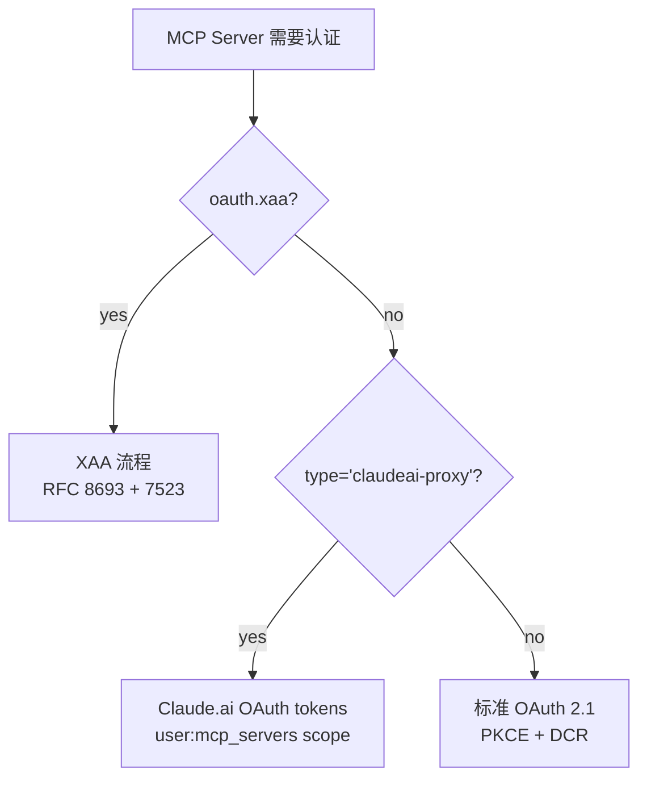

# 07 OAuth 与 3 套认证体系

> auth.ts (2465 行) + xaa.ts (511 行) + xaaIdpLogin.ts (487 行) + claudeai.ts (164 行) ≈ 3600 行——MCP 服务器认证的完整实现。本篇拆 3 套并存的认证系统：标准 OAuth 2.1 PKCE、XAA Cross-App Access、Claude.ai proxy。

## 7.1 3 套并存的认证体系



| 系统 | 触发条件 | 用户体验 | 凭据 |
|------|---------|---------|------|
| **OAuth 2.1 PKCE** | 默认 | 浏览器弹窗 → 用户同意 → 回调 localhost | per-server tokens |
| **XAA Cross-App Access** | `oauth.xaa: true` + `CLAUDE_CODE_ENABLE_XAA=1` | 首次 IdP 登录后**全部服务器静默** | per-issuer id_token + per-server access_token |
| **Claude.ai proxy** | `type: 'claudeai-proxy'` | 复用 Claude.ai 登录 | Claude.ai OAuth tokens |

3 套**互斥但兼容**——同一个 Claude Code 实例可以**同时**连接 3 类服务器。

## 7.2 标准 OAuth 2.1 PKCE 流程

### performMCPOAuthFlow 流程图

```
auth.ts:847-1342 performMCPOAuthFlow
├─ 1. 检查 oauth.xaa → 走 XAA（return）
├─ 2. 读取 cached stepUpScope + resourceMetadataUrl
├─ 3. clearServerTokensFromLocalStorage —— 清旧 token
├─ 4. findAvailablePort() + buildRedirectUri(port)
├─ 5. new ClaudeAuthProvider(handleRedirection=true)
├─ 6. fetchAuthServerMetadata —— RFC 9728 → 8414 双步发现
├─ 7. 起 HTTP server on 127.0.0.1:port
│   ├─ 监听 /callback
│   ├─ 校验 state（CSRF 防御）
│   ├─ xss(error_description) —— XSS 防御
│   └─ unref() —— 不 pin 事件循环
├─ 8. sdkAuth(provider, { serverUrl }) —— SDK 触发 redirect
│   └─ provider.redirectToAuthorization() 调 openBrowser()
├─ 9. await authorizationCode (Promise<string>)
│   └─ 5min timeout
├─ 10. sdkAuth(provider, { authorizationCode }) —— code-for-token
└─ 11. provider.saveTokens() —— 落 keychain
```

### ClaudeAuthProvider 实现 OAuthClientProvider 接口

`auth.ts:1376-2000+` 实现 MCP SDK 的 `OAuthClientProvider`：

```ts
// auth.ts:1376
export class ClaudeAuthProvider implements OAuthClientProvider {
  get redirectUrl(): string
  get authorizationUrl(): string | undefined
  get clientMetadata(): OAuthClientMetadata
  get clientMetadataUrl(): string | undefined  // CIMD (SEP-991)
  setMetadata(metadata)
  markStepUpPending(scope)
  async state(): Promise<string>           // CSRF 防御
  async clientInformation(): Promise<...>  // 读 stored clientId
  async saveClientInformation(...)         // DCR 后保存
  async tokens(): Promise<OAuthTokens>     // SDK 每次请求都调
  async saveTokens(tokens)                 // 存 keychain
  async redirectToAuthorization(url)       // 开浏览器
  async saveCodeVerifier(verifier)         // PKCE 校验码
  async codeVerifier(): Promise<string>
  async invalidateCredentials(scope)       // 失效粒度: all/client/tokens/verifier/discovery
  async saveDiscoveryState(state)
}
```

**16 个 method**——MCP SDK 通过这个 provider 桩**完全把凭据存储托管给 Claude Code**。

### clientMetadata 公共客户端

```ts
// auth.ts:1417
get clientMetadata(): OAuthClientMetadata {
  return {
    client_name: `Claude Code (${this.serverName})`,
    redirect_uris: [this.redirectUri],
    grant_types: ['authorization_code', 'refresh_token'],
    response_types: ['code'],
    token_endpoint_auth_method: 'none', // Public client
  }
}
```

`token_endpoint_auth_method: 'none'` —— **public client**（无 client_secret），完全靠 PKCE 防御 code 拦截攻击。

### CIMD URL-based client_id (SEP-991)

```ts
// auth.ts:1445
get clientMetadataUrl(): string | undefined {
  const override = process.env.MCP_OAUTH_CLIENT_METADATA_URL
  if (override) return override
  return MCP_CLIENT_METADATA_URL
}
```

CIMD（Client ID Metadata Document）—— 当 AS 支持 `client_id_metadata_document_supported: true` 时，**SDK 用这个 URL 当 client_id**，不做 DCR。

好处：
- **无需 register** —— 千个用户共享一个 client_id（URL 本身）；
- **client metadata 自描述** —— AS fetch 这个 URL 拿到 client_metadata；
- **支持 FedStart 等场景** —— Claude Code 不需要在每个 AS 单独注册。

环境变量 override 允许测试/企业场景指定不同 URL。

### state CSRF 防御

```ts
// auth.ts:1473
async state(): Promise<string> {
  if (!this._state) {
    this._state = randomBytes(32).toString('base64url')
  }
  return this._state
}
```

`/callback` 收到 state 时严格比对（auth.ts:1110）：

```ts
if (!error && state !== oauthState) {
  res.writeHead(400, ...)
  rejectOnce(new Error('OAuth state mismatch - possible CSRF attack'))
}
```

state 不匹配——**直接拒绝**，认定 CSRF 攻击。

### xss 输出 sanitize

```ts
// auth.ts:1123
const sanitizedError = xss(String(error))
const sanitizedErrorDescription = errorDescription ? xss(String(errorDescription)) : ''
res.end(`<h1>Authentication Error</h1><p>${sanitizedError}: ${sanitizedErrorDescription}</p>`)
```

`/callback` 把 OAuth error 写回浏览器——**必须 xss sanitize**，否则恶意 AS 可以注入 JS 到 localhost 页面（同源策略下能读 localStorage / cookies）。

### authorizationCode Promise + abort 集成

`auth.ts:1029-1214` ——把 `createServer().listen()` 包成 Promise：

```ts
const authorizationCode = await new Promise<string>((resolve, reject) => {
  // 1. abortSignal 集成
  if (abortSignal) {
    abortHandler = () => {
      cleanup()
      rejectOnce(new AuthenticationCancelledError())
    }
    abortSignal.addEventListener('abort', abortHandler)
  }

  // 2. 手动 callback URL（远程环境）
  if (options?.onWaitingForCallback) {
    options.onWaitingForCallback((callbackUrl) => { /* 解析 + state 校验 */ })
  }

  // 3. localhost HTTP server
  server = createServer((req, res) => { /* 处理 /callback */ })
  server.listen(port, '127.0.0.1', async () => {
    const result = await sdkAuth(provider, { serverUrl, scope, resourceMetadataUrl })
  })
  server.unref()  // 不 pin event loop

  // 4. 5min timeout
  timeoutId = setTimeout(() => { ... }, 5 * 60 * 1000)
  timeoutId.unref()
})
```

3 个并发结束路径（用户取消 / 收到 code / 手动 paste callback URL / 超时），用 `resolveOnce`/`rejectOnce` 防重入。

### server.unref() + timeoutId.unref()

`auth.ts:1202`：

> Don't let the callback server or timeout pin the event loop — if the UI component unmounts without aborting (e.g. parent intercepts Esc), we'd rather let the process exit than stay alive for 5 minutes holding the port.

`.unref()` 让 server / timer **不阻止进程退出**。如果父 UI 卡死，5min timeout 不会让进程僵死。

### EADDRINUSE 平台分支

```ts
// auth.ts:1153
server.on('error', (err: NodeJS.ErrnoException) => {
  if (err.code === 'EADDRINUSE') {
    const findCmd = getPlatform() === 'windows'
      ? `netstat -ano | findstr :${port}`
      : `lsof -ti:${port} -sTCP:LISTEN`
    rejectOnce(new Error(
      `OAuth callback port ${port} is already in use... ` +
      `Run \`${findCmd}\` to find it.`,
    ))
  }
})
```

端口被占——**给出平台特定的诊断命令**。Windows 用 netstat，Unix 用 lsof。这种细节是真实生产里"前一次没退干净的 callback server 占了 port"的常见现象。

## 7.3 metadata 发现：RFC 9728 → RFC 8414 双步

`auth.ts:256-311 fetchAuthServerMetadata`：

```
configuredMetadataUrl? → 直接 fetch + https 校验
       ↓ 没有 ↓
discoverOAuthServerInfo(serverUrl)
  └─ RFC 9728: GET /.well-known/oauth-protected-resource
       └─ authorization_servers[0]
       └─ RFC 8414: GET {AS}/.well-known/oauth-authorization-server
       ↓ 失败 ↓
discoverAuthorizationServerMetadata(serverUrl) —— 仅当 pathname !== '/'
  └─ legacy: /.well-known/oauth-authorization-server/{path}
```

3 层 fallback：
1. **`authServerMetadataUrl` 配置**：用户在 `.mcp.json` 明指；强制 https；
2. **RFC 9728 PRM**：标准发现路径；
3. **legacy path-aware RFC 8414**：兼容老 server。

注释（auth.ts:251）：

> configuredMetadataUrl is user-controlled via .mcp.json. Project-scoped MCP servers require user approval before connecting (same trust level as the MCP server URL itself).

`.mcp.json` 是用户级 trust——`authServerMetadataUrl` 让用户指定 AS 在另一个 host。

## 7.4 normalizeOAuthErrorBody —— Slack 兼容

```ts
// auth.ts:147-189
const NONSTANDARD_INVALID_GRANT_ALIASES = new Set([
  'invalid_refresh_token',
  'expired_refresh_token',
  'token_expired',
])

export async function normalizeOAuthErrorBody(response: Response): Promise<Response> {
  if (!response.ok) return response
  const text = await response.text()
  const parsed = jsonParse(text)
  if (OAuthTokensSchema.safeParse(parsed).success) return new Response(text, response)
  const result = OAuthErrorResponseSchema.safeParse(parsed)
  if (!result.success) return new Response(text, response)

  const normalized = NONSTANDARD_INVALID_GRANT_ALIASES.has(result.data.error)
    ? { error: 'invalid_grant', error_description: ... }
    : result.data
  return new Response(jsonStringify(normalized), { status: 400, ... })
}
```

3 个细节：

### Slack 用 HTTP 200 返回 error

注释（auth.ts:128）：

> Some OAuth servers (notably Slack) return HTTP 200 for all responses, signaling errors via the JSON body instead.

不符合 OAuth 规范但**生产里就是这样**——必须兼容。

### SDK 行为：!response.ok 才走 error 路径

SDK 的 `executeTokenRequest` 只在 !ok 时 parse error。Slack 的 200 + `{"error":"..."}` 会被 SDK 当成 token response → ZodError → 误判为 `request_failed`，refresh invalidate 不触发。

### 改写为 400 让 SDK 走正确分支

把 200 + error body 包装成 **fake 400 response**——让 SDK 的标准 error mapping 生效。

`NONSTANDARD_INVALID_GRANT_ALIASES` 同时**翻译 Slack 私有 error code** 到 `invalid_grant`——让 `InvalidGrantError` 类型分支命中，触发 token 清除。

## 7.5 createAuthFetch fresh-timeout

`auth.ts:198-237 createAuthFetch`：

```ts
function createAuthFetch(): FetchLike {
  return async (url, init?) => {
    const timeoutSignal = AbortSignal.timeout(AUTH_REQUEST_TIMEOUT_MS) // 30s
    const isPost = init?.method?.toUpperCase() === 'POST'

    if (!init?.signal) {
      const response = await fetch(url, { ...init, signal: timeoutSignal })
      return isPost ? normalizeOAuthErrorBody(response) : response
    }

    // combine: abort when either fires
    const controller = new AbortController()
    const abort = () => controller.abort()
    init.signal.addEventListener('abort', abort)
    timeoutSignal.addEventListener('abort', abort)

    const cleanup = () => {
      init.signal?.removeEventListener('abort', abort)
      timeoutSignal.removeEventListener('abort', abort)
    }

    if (init.signal.aborted) controller.abort()

    try {
      const response = await fetch(url, { ...init, signal: controller.signal })
      cleanup()
      return isPost ? normalizeOAuthErrorBody(response) : response
    } catch (error) {
      cleanup() // prevent event listener leaks
      throw error
    }
  }
}
```

3 个细节呼应 [03 HTTP/SSE/WS transport](./03-HTTP-SSE-WebSocket-transport.md) 的 wrapFetchWithTimeout：

1. **每次请求 fresh signal** —— 避免共享 signal 30s 后所有请求都 abort；
2. **combined signal** —— 用户 abort 或 timeout 都能 cancel；
3. **listener cleanup** —— 避免 EventEmitter leak（init.signal 是长寿命对象时）。

POST 才走 `normalizeOAuthErrorBody` —— Slack 兼容只对 POST 生效（token endpoint 都是 POST）。

## 7.6 tokens() —— 每请求调，proactive refresh

`auth.ts:1540-1702 tokens()`：

```ts
async tokens(): Promise<OAuthTokens | undefined> {
  // SDK 每个 MCP 请求都调一次——不能 force keychain refresh
  const storage = getSecureStorage()
  const data = await storage.readAsync()
  const tokenData = data?.mcpOAuth?.[serverKey]

  // XAA: 没 refresh_token 但有 id_token → silent exchange
  if (isXaaEnabled() && this.serverConfig.oauth?.xaa &&
      !tokenData?.refreshToken &&
      (!tokenData?.accessToken || expiresIn <= 300)) {
    this._refreshInProgress ??= this.xaaRefresh().finally(...)
    const refreshed = await this._refreshInProgress
    if (refreshed) return refreshed
  }

  if (!tokenData) return undefined

  const expiresIn = (tokenData.expiresAt - Date.now()) / 1000

  // step-up: 当前 scope 不够 → 不返回 refresh_token，强制 PKCE
  const needsStepUp = this._pendingStepUpScope !== undefined &&
    this._pendingStepUpScope.split(' ').some(s => !currentScopes.includes(s))

  if (expiresIn <= 0 && !tokenData.refreshToken) return undefined

  // proactive refresh: <300s 到期就刷
  if (expiresIn <= 300 && tokenData.refreshToken && !needsStepUp) {
    this._refreshInProgress ??= this.refreshAuthorization(tokenData.refreshToken).finally(...)
    const refreshed = await this._refreshInProgress
    if (refreshed) return refreshed
  }

  return {
    access_token: tokenData.accessToken,
    refresh_token: needsStepUp ? undefined : tokenData.refreshToken,
    expires_in: expiresIn,
    scope: tokenData.scope,
    token_type: 'Bearer',
  }
}
```

5 个隐性判断：

### 1. 不 force clearKeychainCache

注释（auth.ts:1543）：

> tokens() is called by the MCP SDK's _commonHeaders on every request, and forcing a cache miss would trigger a blocking spawnSync(`security find-generic-password`) 30-40x/sec. See CPU profile: spawnSync was 7.2% of total CPU after PR #19436.

**`tokens()` 是热路径**——SDK 每个请求都调（包括 list_tools / call_tool）。如果 force keychain refresh，spawnSync 会占 7.2% CPU。靠 keychain cache TTL + storage.update() 时 invalidate 来同步跨进程状态。

### 2. _refreshInProgress 单飞

```ts
this._refreshInProgress ??= this.refreshAuthorization(tokenData.refreshToken).finally(...)
```

同时多个 SDK 调用都 trigger refresh——只发一次请求，所有调用方共享 Promise。Promise 完成后清理。

### 3. proactive refresh 阈值 300s

```ts
if (expiresIn <= 300 && tokenData.refreshToken && !needsStepUp) {
```

5 分钟内到期就 refresh——避免**请求到一半 token 过期**导致 401 重试增加延迟。注释（auth.ts:1646）：

> While MCP servers should return 401 for expired tokens (which triggers SDK-level refresh), proactively refreshing before expiry provides a smoother user experience.

### 4. needsStepUp 跳过 refresh_token

RFC 6749 §6 规定 refresh **不能 elevate scope**——如果 server 要求新 scope，refresh 后还是 403。tokens() 检测到 `_pendingStepUpScope` 时**直接返回不带 refresh_token 的对象**，强制 SDK 走 PKCE flow。

注释（auth.ts:1647）：

> Skip when step-up is pending — refreshing can't elevate scope (RFC 6749 §6).

### 5. expired 但有 refresh_token —— 返回过期 token

```ts
if (expiresIn <= 0 && !tokenData.refreshToken) return undefined
```

只有同时 expired 且 **没有 refresh_token** 才返 undefined。否则**返回过期 token**——让 SDK 用它请求一次（401），由 SDK 自动 refresh-retry。

## 7.7 step-up auth (insufficient_scope)

`auth.ts:1354-1374 wrapFetchWithStepUpDetection`：

```ts
export function wrapFetchWithStepUpDetection(baseFetch, provider): FetchLike {
  return async (url, init) => {
    const response = await baseFetch(url, init)
    if (response.status === 403) {
      const wwwAuth = response.headers.get('WWW-Authenticate')
      if (wwwAuth?.includes('insufficient_scope')) {
        const match = wwwAuth.match(/scope=(?:"([^"]+)"|([^\s,]+))/)
        const scope = match?.[1] ?? match?.[2]
        if (scope) provider.markStepUpPending(scope)
      }
    }
    return response
  }
}
```

注释解释 bug 链：

> Without this, the SDK's authInternal sees refresh_token → refreshes (uselessly, since RFC 6749 §6 forbids scope elevation via refresh) → returns 'AUTHORIZED' → retry → 403 again → aborts with "Server returned 403 after trying upscoping", never reaching redirectToAuthorization where step-up scope is persisted.

故事是这样的：

1. MCP server 需要 elevated scope → 返回 403 + `WWW-Authenticate: ... scope="extra"`
2. SDK 收到 403 → 调 auth() → tokens() 返回 refresh_token → refresh 拿新 token（**scope 还是原来的**）
3. SDK retry → 403 → 再 refresh → 403 → SDK 放弃，报错"server returned 403 after upscoping"
4. **永远走不到 PKCE flow** —— bug

修复：**在 fetch wrapper 里截获 403**，看到 insufficient_scope **先 markStepUpPending**。后续 tokens() 看到 _pendingStepUpScope 就**故意不返回 refresh_token**，强制 SDK 走 PKCE flow。

[GitHub issue #28258](https://github.com/anthropics/claude-code/issues/28258)。

`redirectToAuthorization` 持久化 scope（auth.ts:1890）：

```ts
if (this._scopes && !this.handleRedirection) {
  // 把 step-up scope 存到 keychain
  existing.stepUpScope = this._scopes
  storage.update(existingData)
}
```

下次 performMCPOAuthFlow **从缓存读 stepUpScope**——不需要再发请求触发 403。

## 7.8 XAA Cross-App Access (SEP-990)

### 用户体验差异

| 场景 | 标准 OAuth | XAA |
|------|----------|-----|
| 首个 server 连接 | 浏览器弹窗 → 同意 | 浏览器弹窗 → IdP 登录 |
| 第 2-N 个 XAA server | 浏览器弹窗 → 同意 | **零交互**（id_token 缓存复用）|
| 跨 Claude Code 会话 | 浏览器弹窗（每个 server）| **零交互**（id_token 还在 keychain）|

注释（auth.ts:647-662）：

> One IdP browser login is reused across all XAA-configured MCP servers:
> 1. Acquire an id_token from the IdP (cached in keychain by issuer)
> 2. Run the RFC 8693 + RFC 7523 exchange (no browser)
> 3. Save tokens to the same keychain slot as normal OAuth

### 4 步交换

`xaa.ts:1-17` 说明：

```
1. RFC 8693 Token Exchange at the IdP: id_token → ID-JAG
2. RFC 7523 JWT Bearer Grant at the AS: ID-JAG → access_token

Spec refs:
  - ID-JAG (IETF draft): draft-ietf-oauth-identity-assertion-authz-grant
  - MCP ext-auth (SEP-990): github.com/modelcontextprotocol/ext-auth
  - RFC 8693 (Token Exchange), RFC 7523 (JWT Bearer), RFC 9728 (PRM)
```

具体常量（xaa.ts:31-34）：

```ts
const TOKEN_EXCHANGE_GRANT = 'urn:ietf:params:oauth:grant-type:token-exchange'
const JWT_BEARER_GRANT = 'urn:ietf:params:oauth:grant-type:jwt-bearer'
const ID_JAG_TOKEN_TYPE = 'urn:ietf:params:oauth:token-type:id-jag'
const ID_TOKEN_TYPE = 'urn:ietf:params:oauth:token-type:id_token'
```

### redactTokens —— 调试日志安全

```ts
// xaa.ts:91
const SENSITIVE_TOKEN_RE =
  /"(access_token|refresh_token|id_token|assertion|subject_token|client_secret)"\s*:\s*"[^"]*"/g

function redactTokens(raw: unknown): string {
  const s = typeof raw === 'string' ? raw : jsonStringify(raw)
  return s.replace(SENSITIVE_TOKEN_RE, (_, k) => `"${k}":"[REDACTED]"`)
}
```

注释（xaa.ts:86-90）：

> Matches quoted values for known token-bearing keys regardless of nesting depth. Works on both parsed-then-stringified bodies AND raw text() error bodies from !res.ok paths — a misbehaving AS that echoes the request's subject_token/assertion/client_secret in a 4xx error envelope must not leak into debug logs.

**正则替换敏感字段**——即使错误日志包含完整请求 body 也不会泄露 token。

### z.coerce.number() —— PHP IdP 兼容

```ts
// xaa.ts:107
expires_in: z.coerce.number().optional(),
```

注释：

> z.coerce tolerates IdPs that send expires_in as a string (common in PHP-backed IdPs) — technically non-conformant JSON but widespread.

**真实生态适配**——PHP IdP 字符串化数字是常见非规范，coerce 拦下。

### XaaTokenExchangeError + shouldClearIdToken

```ts
// xaa.ts:77
export class XaaTokenExchangeError extends Error {
  readonly shouldClearIdToken: boolean
  constructor(message: string, shouldClearIdToken: boolean) {
    super(message)
    this.shouldClearIdToken = shouldClearIdToken
  }
}
```

注释（xaa.ts:71-76）：

> Thrown by requestJwtAuthorizationGrant when the IdP token-exchange leg fails. Carries `shouldClearIdToken` so callers can decide whether to drop the cached id_token based on OAuth error semantics (not substring matching):
>   - 4xx / invalid_grant / invalid_token → id_token is bad, clear it
>   - 5xx → IdP is down, id_token may still be valid, keep it
>   - 200 with structurally-invalid body → protocol violation, clear it

**按 HTTP 语义分类**——不靠字符串匹配。`shouldClearIdToken` 字段让 caller 直接决策。

### makeXaaFetch + AbortSignal.any

```ts
// xaa.ts:42
function makeXaaFetch(abortSignal?: AbortSignal): FetchLike {
  return (url, init) => {
    const timeout = AbortSignal.timeout(XAA_REQUEST_TIMEOUT_MS)
    const signal = abortSignal
      ? AbortSignal.any([timeout, abortSignal])
      : timeout
    return fetch(url, { ...init, signal })
  }
}
```

注释：

> Using AbortSignal.any ensures the user's cancel (e.g. Esc in the auth menu) actually aborts in-flight requests rather than being clobbered by the timeout signal.

**`AbortSignal.any([a, b])` 任一 fire 就 abort**——比手动 combine + cleanup 简洁。Node 20+ 才有。

### xaaRefresh —— silent re-auth

`auth.ts:1751-1850 xaaRefresh`：

```ts
private async xaaRefresh(): Promise<OAuthTokens | undefined> {
  const idp = getXaaIdpSettings()
  if (!idp) return undefined  // config 被删

  const idToken = getCachedIdpIdToken(idp.issuer)
  if (!idToken) return undefined  // 需要 xaa login

  const oidc = await discoverOidc(idp.issuer)
  const tokens = await performCrossAppAccess(...)
  // 写直接到 storage（不走 saveTokens，因为要写 clientId+clientSecret）
  return { access_token, token_type: 'Bearer', expires_in, scope, refresh_token }
}
```

注释（auth.ts:1804）：

> Write directly (not via saveTokens) so clientId + clientSecret land in storage even when this is the first write for serverKey. saveTokens only spreads existing data; if no prior performMCPXaaAuth ran, revokeServerTokens would later read tokenData.clientId as undefined and send a client_id-less RFC 7009 request that strict ASes reject.

直写 storage 而不是 saveTokens——因为 `saveTokens` 只设 token 字段，**clientId/clientSecret 不会落盘**。如果之前没有 interactive XAA 跑过，revoke 时会读不到 client_id。

### TODO(xaa-ga) cross-process lockfile

注释（auth.ts:1743）：

> TODO(xaa-ga): add cross-process lockfile before GA. `_refreshInProgress` only dedupes within one process — two CC instances with expiring tokens both fire the full 4-request XAA chain and race on storage.update().

**坦诚的 TODO**——`_refreshInProgress` 是进程内 dedup，跨进程靠 lockfile（参考 `refreshAuthorization` 的实现）。GA 前要补上。

## 7.9 Claude.ai proxy (claudeai-proxy)

### 复用 Claude.ai OAuth tokens

`claudeai.ts:39 fetchClaudeAIMcpConfigsIfEligible`：

```ts
export const fetchClaudeAIMcpConfigsIfEligible = memoize(async () => {
  if (isEnvDefinedFalsy(process.env.ENABLE_CLAUDEAI_MCP_SERVERS)) return {}

  const tokens = getClaudeAIOAuthTokens()
  if (!tokens?.accessToken) return {}

  // 直接 scope 检查（而非 isClaudeAISubscriber）
  if (!tokens.scopes?.includes('user:mcp_servers')) return {}

  const response = await axios.get(`${baseUrl}/v1/mcp_servers?limit=1000`, {
    headers: {
      Authorization: `Bearer ${tokens.accessToken}`,
      'anthropic-beta': 'mcp-servers-2025-12-04',
      'anthropic-version': '2023-06-01',
    },
    timeout: 5000,
  })

  // 命名 + 防冲突
  for (const server of response.data.data) {
    let finalName = `claude.ai ${server.display_name}`
    while (usedNormalizedNames.has(normalize(finalName))) {
      count++
      finalName = `${baseName} (${count})`
    }
    configs[finalName] = {
      type: 'claudeai-proxy',
      url: server.url,
      id: server.id,
      scope: 'claudeai',
    }
  }
})
```

5 个判断：

### 1. scope 直查而不是 isClaudeAISubscriber()

注释（claudeai.ts:61-65）：

> In non-interactive mode, isClaudeAISubscriber() returns false when ANTHROPIC_API_KEY is set (even with valid OAuth tokens) because preferThirdPartyAuthentication() causes isAnthropicAuthEnabled() to return false. Checking the scope directly allows users with both API keys and OAuth tokens to access claude.ai MCPs in print mode.

API key + OAuth token 并存场景——`isClaudeAISubscriber()` 误判，直接看 scope 才正确。

### 2. anthropic-beta header

```ts
'anthropic-beta': 'mcp-servers-2025-12-04',
```

新功能走 beta 标头——稳定后改默认。

### 3. memoize 整个 session

`memoize(fn)` —— 一个 CLI session 只 fetch 一次。`clearClaudeAIMcpConfigsCache()` 在 login 后调，让下次刷新看到新 server。

### 4. claude.ai-prefixed naming + 冲突防御

```ts
let finalName = `claude.ai ${server.display_name}`
while (usedNormalizedNames.has(normalize(finalName))) {
  count++
  finalName = `${baseName} (${count})`
}
```

注释（claudeai.ts:93-96）：

> Track used normalized names to detect collisions and assign (2), (3), etc. suffixes. We check the final normalized name (including suffix) to handle edge cases where a suffixed name collides with another server's base name (e.g., "Example Server 2" colliding with "Example Server! (2)" which both normalize to claude_ai_Example_Server_2).

**按 normalized name 去重**——而不是 raw name。`Example Server 2` 和 `Example Server! (2)` 都 normalize 到 `claude_ai_Example_Server_2`，按 normalized 检测能避开。

### 5. markClaudeAiMcpConnected 启动通知 gating

```ts
// claudeai.ts:154
export function markClaudeAiMcpConnected(name: string): void {
  saveGlobalConfig(current => {
    const seen = current.claudeAiMcpEverConnected ?? []
    if (seen.includes(name)) return current
    return { ...current, claudeAiMcpEverConnected: [...seen, name] }
  })
}
```

注释（claudeai.ts:148-153）：

> Gates the "N connectors unavailable/need auth" startup notifications: a connector that was working yesterday and is now failed is a state change worth surfacing; an org-configured connector that's been needs-auth since it showed up is one the user has demonstrably ignored.

**启动通知粒度**——曾经连过的 connector 失败才通知用户。从未连过的 connector 不刷屏。

## 7.10 revokeServerTokens —— RFC 7009 best-effort

`auth.ts:467-618 revokeServerTokens`：

```ts
export async function revokeServerTokens(serverName, serverConfig, { preserveStepUpState = false } = {}) {
  // 1. server-side revocation (best-effort)
  if (tokenData?.accessToken || tokenData?.refreshToken) {
    const metadata = await fetchAuthServerMetadata(serverName, asUrl, ...)
    const revocationEndpoint = metadata.revocation_endpoint
    if (revocationEndpoint) {
      // 先 refresh_token（更重要——阻止生成新 access_token）
      if (tokenData.refreshToken) {
        await revokeToken({ token: refreshToken, tokenTypeHint: 'refresh_token', ... })
      }
      // 后 access_token（可能已被 refresh 撤销隐式失效）
      if (tokenData.accessToken) {
        await revokeToken({ token: accessToken, tokenTypeHint: 'access_token', ... })
      }
    }
  }

  // 2. local clear (always)
  clearServerTokensFromLocalStorage(serverName, serverConfig)

  // 3. preserve step-up state for re-auth optimization
  if (preserveStepUpState && (tokenData?.stepUpScope || tokenData?.discoveryState)) {
    storage.update({ ...freshData, mcpOAuth: { [serverKey]: { stepUpScope, discoveryState } } })
  }
}
```

3 个细节：

### 1. revoke 顺序：refresh first

注释（auth.ts:462-466）：

> Per RFC 7009, we revoke the refresh token first (the long-lived credential), then the access token. Revoking the refresh token prevents generation of new access tokens and many servers implicitly invalidate associated access tokens.

refresh_token 是**长寿命凭据**——先撤它防止后续 access_token 生成。很多 AS 撤 refresh 时连带撤所有相关 access。

### 2. RFC 7009 + Bearer fallback

`revokeToken` (auth.ts:381-459) 第一次按 RFC 7009 用 `client_id` in body / Basic auth，**收到 401 就 retry with Bearer**：

```ts
} catch (error: unknown) {
  if (error.response?.status === 401 && accessToken) {
    params.delete('client_id')
    params.delete('client_secret')
    await axios.post(endpoint, params, {
      headers: { ...headers, Authorization: `Bearer ${accessToken}` },
    })
  }
}
```

> This fallback should rarely be needed - most servers either accept the compliant approach or ignore unexpected headers.

防御非合规 server。

### 3. preserveStepUpState

"Clear Auth"（默认）：完全清。
"Re-authenticate"：保留 `stepUpScope` + `discoveryState`——让下次 PKCE flow **跳过 scope 探测**直接用缓存。

## 7.11 getServerKey —— 配置敏感

`auth.ts:325-341`：

```ts
export function getServerKey(serverName, serverConfig): string {
  const configJson = jsonStringify({
    type: serverConfig.type,
    url: serverConfig.url,
    headers: serverConfig.headers || {},
  })

  const hash = createHash('sha256').update(configJson).digest('hex').substring(0, 16)

  return `${serverName}|${hash}`
}
```

注释：

> Generates a unique key for server credentials based on both name and config hash. This prevents credentials from being reused across different servers with the same name or different configurations.

例：同名 server 在 `local` 和 `project` scope 配不同 URL——hash 不同，凭据不共享。改 URL 也会生成新 key，**旧 token 不会污染新配置**。

## 7.12 hasMcpDiscoveryButNoToken —— 探测优化

`auth.ts:349-363`：

```ts
export function hasMcpDiscoveryButNoToken(serverName, serverConfig): boolean {
  // XAA 例外：cached id_token 可静默 re-auth
  if (isXaaEnabled() && serverConfig.oauth?.xaa) return false

  const serverKey = getServerKey(serverName, serverConfig)
  const entry = getSecureStorage().read()?.mcpOAuth?.[serverKey]
  return entry !== undefined && !entry.accessToken && !entry.refreshToken
}
```

返回 true 表示"探测过但没 token"—— [05 client 核心](./05-client核心-连接与capability.md) 在 connectToServer 看到这个就**跳过连接尝试**直接 mark needs-auth。

注释（auth.ts:344-348）：

> True when we have probed this server before (OAuth discovery state is stored) but hold no credentials to try. A connection attempt in this state is guaranteed to 401.

**避免无效 401 round trip**——节流 + 加速启动。

XAA 例外原因：`oauth.xaa` 配置下 `tokens()` 会**触发 xaaRefresh**，即使没 access/refresh 也可能成功（用 cached id_token）。所以 XAA server 不跳过尝试。

## 7.13 几个隐性设计判断

### 1. 3 套并存而非统一

XAA 不是替代 OAuth——而是企业部署下**绕过 per-server consent dance**的优化。Claude.ai proxy 是**复用 Claude.ai 登录**给一类特殊 server。3 套互补。

### 2. ClaudeAuthProvider 是 SDK 桩

`OAuthClientProvider` 接口是 MCP SDK 定义的——Claude Code 实现 16 个 method 把存储托管给 keychain。**SDK 不知道存哪**。

### 3. tokens() 不 force keychain refresh

热路径，spawnSync 占 7.2% CPU。靠 cache TTL + 内进程 invalidate 同步。

### 4. proactive refresh 300s

5 分钟前刷——避免请求中间 token 过期。

### 5. _refreshInProgress 进程内单飞

多并发 SDK 调用共享一个 refresh Promise。跨进程**还有 race**（TODO 用 lockfile 修）。

### 6. step-up 通过 omit refresh_token 强制 PKCE

RFC 6749 §6 禁止 refresh elevate scope——只能 PKCE。但 SDK 不知道，会卡在 refresh-retry 循环。Claude Code 用 `markStepUpPending` flag + 故意 omit refresh_token 跳出循环。

### 7. state CSRF 防御 + xss sanitize

OAuth 安全的 2 个标准要求——都到位。

### 8. server.unref() / timeoutId.unref()

不 pin 事件循环——父 UI 卡死时进程能退出。

### 9. EADDRINUSE 平台分支诊断

给 Windows / Unix 不同诊断命令——生产里 callback port 冲突是常见现象。

### 10. normalizeOAuthErrorBody Slack 兼容

Slack 用 200 + error body——必须改写为 400 才能让 SDK 走对的错误分支。

### 11. redactSensitiveUrlParams 日志安全

OAuth code / state / nonce 不进 debug log——防 log 泄露导致 CSRF。

### 12. CIMD (SEP-991) URL-based client_id

避免 DCR——千个用户共享一个 client_id（URL）。

### 13. XAA AbortSignal.any

Node 20+ API，用户 abort 不被 timeout 信号"clobber"。

### 14. XaaTokenExchangeError shouldClearIdToken

按 OAuth 语义（4xx vs 5xx）决定是否清 cache——不靠字符串匹配。

### 15. revoke 顺序 refresh first

RFC 7009 推荐——撤 refresh 等于阻止后续 token 生成。

### 16. Bearer fallback for 非合规 revoke

第二次重试 with Bearer auth——兼容奇葩 server。

### 17. getServerKey hash config

URL/headers 变化即新 key——避免凭据污染。

### 18. hasMcpDiscoveryButNoToken 跳过

避免 401 round trip——但 XAA 例外（cached id_token 可救回来）。

### 19. memoize claudeai 整 session

config 拉一次——`clearClaudeAIMcpConfigsCache()` 显式刷。

### 20. scope-direct check（不用 isClaudeAISubscriber）

API key + OAuth 并存时 isClaudeAISubscriber() 误判——直接看 scope。

### 21. claude.ai naming 冲突按 normalized 去重

`Example Server 2` 和 `Example Server! (2)` 都映射到同个 normalized name——按 normalized 去重才对。

### 22. markClaudeAiMcpConnected 启动通知 gating

只通知"曾连过现在失败"——避免新增 connector 启动就刷屏。

### 23. preserveStepUpState 优化 re-auth

re-auth 时保 cached scope——下次跳过 scope 探测。

## 7.14 与其它专题串联

- **[01 McpServerConfig](./01-McpServerConfig与8种transport-schema.md)**：`oauth.xaa` 配置 + `oauth.authServerMetadataUrl` 用户 trust；
- **[03 HTTP/SSE/WS transport](./03-HTTP-SSE-WebSocket-transport.md)**：transport 把 ClaudeAuthProvider attach 到 fetch；
- **[05 client 核心](./05-client核心-连接与capability.md)**：connectToServer 用 `hasMcpDiscoveryButNoToken` 跳过；needs-auth 状态机；
- **[01 secure-storage](../core-models/...)**：keychain 存 `mcpOAuth[serverKey]` 表（待补 core-models 链接）。

## 7.15 小结

- 3 套认证体系并存：OAuth 2.1 PKCE / XAA / Claude.ai proxy；
- ClaudeAuthProvider 实现 16-method SDK 接口——Claude Code 托管凭据存储；
- 标准流程：findPort → server.listen → openBrowser → SDK redirect → callback → code → token；
- state CSRF 防御 + xss sanitize + redactSensitiveUrlParams 三重日志/响应安全；
- server.unref() / timeoutId.unref() —— 不 pin 事件循环；
- metadata 发现 3 层：configured → RFC 9728 PRM → legacy RFC 8414；
- CIMD (SEP-991) URL-based client_id 避开 DCR；
- normalizeOAuthErrorBody 兼容 Slack 200+error body 行为；
- createAuthFetch fresh-timeout + combined signal + listener cleanup；
- tokens() 热路径 —— 不 force keychain refresh（7.2% CPU 教训）、`_refreshInProgress` 单飞、300s proactive refresh；
- step-up auth：用 omit refresh_token 强制 PKCE flow（绕开 SDK refresh-retry 死循环）；
- XAA：RFC 8693 + 7523 4-step exchange，IdP 登录跨 server 复用；
- redactTokens 防 token 进 debug 日志；
- z.coerce.number() 兼容 PHP IdP 字符串数字；
- XaaTokenExchangeError shouldClearIdToken 按 HTTP 语义决策；
- AbortSignal.any —— 用户 cancel 不被 timeout 信号 clobber；
- revoke 顺序：refresh first + Bearer fallback for 非合规 server；
- preserveStepUpState 优化 re-auth；
- getServerKey 按 type+url+headers hash —— 配置变化即新 key；
- hasMcpDiscoveryButNoToken 跳过无效 401（XAA 例外）；
- Claude.ai proxy 复用 OAuth tokens 直查 `user:mcp_servers` scope；
- normalized name 冲突防御（"Example Server 2" vs "Example Server! (2)"）；
- markClaudeAiMcpConnected gating 启动通知。

下一篇 → [08 MCPB bundle 与 plugin 集成](./08-MCPB-bundle与plugin集成.md)
